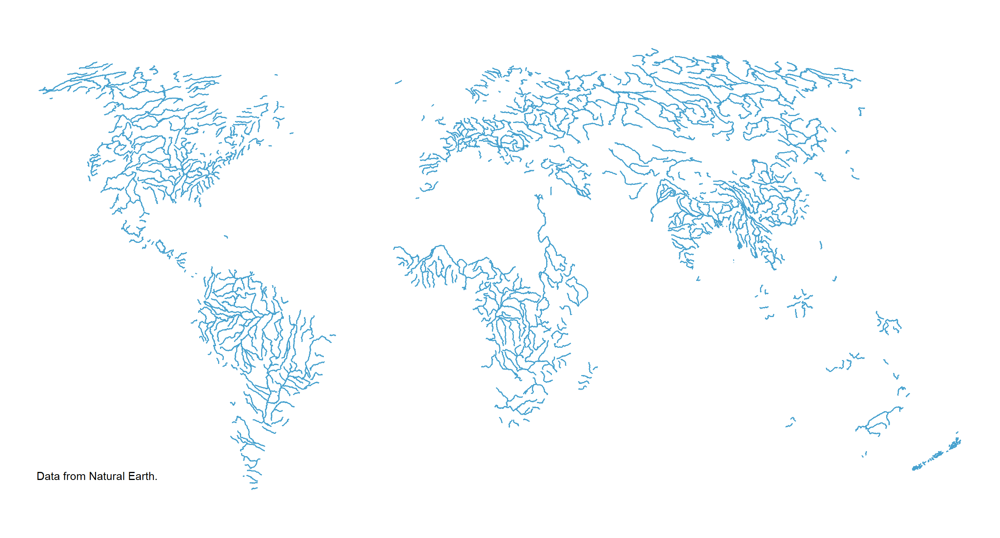

class: center, middle, hide-logo

```{r setup, include = F}
# This is the recommended set up for flipbooks
# you might think about setting cache to TRUE as you gain practice --- building flipbooks from scratch can be time consuming
options(width = 70)
knitr::opts_chunk$set(
  dev.args = list(bg = 'transparent'),
  fig.width = 12, message = TRUE, fig.showtext = TRUE,
  warning = FALSE, comment = "", cache = TRUE, fig.retina = 3
)
knitr::opts_knit$set(global.par = TRUE)
Sys.setenv(`_R_S3_METHOD_REGISTRATION_NOTE_OVERWRITES_` = "false")
# remotes::install_github("luukvdmeer/sfnetworks")
# remotes::install_github("EvaMaeRey/flipbookr")
library(flipbookr)
library(xaringanthemer)
library(sf)
library(sfnetworks)
library(tidygraph)
library(igraph)
library(tidyverse)
```


```{r xaringan-themer, include = F}
style_mono_accent(
  # hex color should be provided, or theme_xaringan doesn't work
  base_color = '#ffa500', #orange
  title_slide_background_image = "figs/milano.png",
  background_image = "figs/milano_bg.png",
  code_font_size = '14px',
  text_slide_number_color = '#b3b3b3', #grey70
  link_color = '#ff4500', #orangered  
  footnote_font_size = '0.5em',
  footnote_position_bottom = "30px",
  code_highlight_color = "#ffedcc", #faded-orange
  extra_css = list(
    ".pull-left-70" = list("float" = "left", "width" = "65.8%"),
    ".pull-right-30" = list("float" = "right", "width" = "28.2%"),
    ".pull-left-30" = list("float" = "left", "width" = "28.2%"),
    ".pull-right-70" = list("float" = "right", "width" = "65.8%"),
    ".orange" = list("color" = "#ffa500"),
    ".note" = list("font-size" = "0.8em", "position" = "absolute", 
      "bottom" = "30px", "padding-right" = "4em")
  )
)
```

```{r color, echo = FALSE, results='asis'}
# crayon needs to be explicitly activated in Rmd
options(crayon.enabled = TRUE)
# Hooks needs to be set to deal with outputs
# thanks to fansi logic
old_hooks <- fansi::set_knit_hooks(knitr::knit_hooks,
                                   which = c("output", "message", "error"))
```

```{r ggplottheme, include = F}
library(ggplot2)
themeX = theme_set(theme_xaringan(text_font_size = 18, title_font_size = 22))
themeV = theme_set(theme_void())
theme_set(themeV)
theme_update(
  axis.ticks = element_line(color = 'grey70'),
  panel.grid = element_line(color = 'grey70', linetype = 'dotted', size = 0.5),
  legend.background = element_rect(fill = "transparent"),
  panel.background = element_rect(fill = "transparent"),
  plot.background = element_rect(fill = "transparent", color = NA)
)
```
### First things first...

You can find the slides for this presentation here: https://sfnetworks.github.io/useR2021/slides
 
...

and the source code on this GitHub repository: https://github.com/sfnetworks/useR2021

---
class: center, middle, hide-logo

## What are geospatial networks?

.pull-left[
Road networks

]

.pull-right[
River networks

]

---
class: center, middle, hide-logo
## How do we work with them in R?

--
.pull-left[

]

--

.pull-right[

]
--
.center[

]

---
class: center, middle, hide-logo

.left[
.pull-left-70[
```{r sfex}
library(sf)
library(sfnetworks)
roxel
```
]
]

.pull-right-30[

### ** `sf` package**

Simple features in R

Spatial vector data (points, lines, polygons)

Compatible with *tidy* workflows

S3 classes
]
---
class: center, middle, hide-logo

.pull-left-70[
.left[
```{r}
library(tidygraph)
roxel %>% 
  st_drop_geometry() %>% 
  as_tbl_graph()
```

]
]

.pull-right-30[

### ** `tidygraph` package**


 Interface to [`igraph`](https://igraph.org/r/)  
 

Supports [`dplyr`](https://dplyr.tidyverse.org/) verbs 


 Introduces new specific *verbs* for graph structures (e.g. `morph`, `bind_graphs`, `graph_join`)


 Allows visualization through [`ggraph`](https://ggraph.data-imaginist.com/)
]

---
class: middle
## Data structure: `sfnetwork` class

### Construction
  
Nodes: `sf` object with `POINT` geometries

Edges: *to* and *from* columns along with edge `LINESTRING` geometries.

Same coordinate system!
  
---
```{r, include = FALSE}
par(mar = c(1, 1, 1, 1))
```

`r chunk_reveal(chunk_name = "toyexample", break_type = "user", display_type = "both", title = "### Construction", width = c(35, 60))`

```{r toyexample, include = FALSE, warnings = FALSE, message = FALSE}
roxel %>% 
  st_geometry() %>% #BREAK
  plot()
```

---
```{r, include = FALSE}
par(mar = c(0, 0, 0, 0))
```

`r chunk_reveal(chunk_name = "toyexample2", break_type = "user", display_type = "both", title = "### Construction", width = c(35, 60))`

```{r toyexample2, include = FALSE, warnings = FALSE, message = FALSE}
roxel %>% 
  as_sfnetwork() %>% #BREAK
  plot() 
```

---
class: center, middle

### What can we do?

#### Network pre-processing and cleaning

---
class: middle

```{r clean1, include = F}
p1 = st_point(c(0, 1))
p2 = st_point(c(1, 1))
p3 = st_point(c(2, 1))
p4 = st_point(c(3, 1))
p5 = st_point(c(4, 1))
p6 = st_point(c(3, 2))
p7 = st_point(c(3, 0))
p8 = st_point(c(4, 3))
p9 = st_point(c(4, 2))
p10 = st_point(c(4, 0))
p11 = st_point(c(5, 2))
p12 = st_point(c(5, 0))
p13 = st_point(c(5, -1))
p14 = st_point(c(5.8, 1))
p15 = st_point(c(6, 1.2))
p16 = st_point(c(6.2, 1))
p17 = st_point(c(6, 0.8))
p18 = st_point(c(6, 2))
p19 = st_point(c(6, -1))
p20 = st_point(c(7, 1))

l1 = st_sfc(st_linestring(c(p1, p2, p3)))
l2 = st_sfc(st_linestring(c(p3, p4, p5)))
l3 = st_sfc(st_linestring(c(p6, p4, p7)))
l4 = st_sfc(st_linestring(c(p8, p11, p9)))
l5 = st_sfc(st_linestring(c(p9, p5, p10)))
l6 = st_sfc(st_linestring(c(p8, p9)))
l7 = st_sfc(st_linestring(c(p10, p12, p13, p10)))
l8 = st_sfc(st_linestring(c(p5, p14)))
l9 = st_sfc(st_linestring(c(p15, p14)))
l10 = st_sfc(st_linestring(c(p16, p15)))
l11 = st_sfc(st_linestring(c(p14, p17)))
l12 = st_sfc(st_linestring(c(p17, p16)))
l13 = st_sfc(st_linestring(c(p15, p18)))
l14 = st_sfc(st_linestring(c(p17, p19)))
l15 = st_sfc(st_linestring(c(p16, p20)))

lines = c(l1, l2, l3, l4, l5, l6, l7, l8, l9, l10, l11, l12, l13, l14, l15)

net = as_sfnetwork(lines)
```

```{r, include = FALSE}
edge_colors = function(x) ggsci::pal_igv(palette = "default")(ecount(x))
```

### Network pre-processing and cleaning

#### Initial network

```{r clean2, echo = F}
plot(st_geometry(net, "edges"), col = edge_colors(net), lwd = 8)
plot(st_geometry(net, "nodes"), pch = 20, cex = 4, add = TRUE)
```

.note[
Check the [code and docs for network cleaning and pre-processing here.](https://luukvdmeer.github.io/sfnetworks/articles/preprocess_and_clean.html)
]

---
class: middle
### Network pre-processing and cleaning

#### Simplifying edges

```{r clean3, echo = F}
simple = net %>%
  activate("edges") %>% 
  arrange(edge_length()) %>% 
  filter(!edge_is_multiple()) %>% 
  filter(!edge_is_loop())

plot(st_geometry(simple, "edges"), col = edge_colors(simple), lwd = 8)
plot(st_geometry(simple, "nodes"), pch = 20, cex = 4, add = TRUE)
```

```{r, echo = F}
simple = net %>%
  activate("edges") %>% 
  arrange(edge_length()) %>% 
  filter(!edge_is_multiple()) %>% 
  filter(!edge_is_loop())
```

.note[
Check the [code and docs for network cleaning and pre-processing here.](https://luukvdmeer.github.io/sfnetworks/articles/preprocess_and_clean.html)
]

---
class: middle
### Network pre-processing and cleaning

#### Subdividing edges

```{r clean4, echo = F}
subdivision = convert(simple, to_spatial_subdivision)
plot(st_geometry(subdivision, "edges"), col = edge_colors(subdivision), lwd = 8)
plot(st_geometry(subdivision, "nodes"), pch = 20, cex = 4, add = TRUE)
```

```{r, echo = F}
subdivision = convert(simple, to_spatial_subdivision)
```

.note[
Check the [code and docs for network cleaning and pre-processing here.](https://luukvdmeer.github.io/sfnetworks/articles/preprocess_and_clean.html)
]

---
class: middle
### Network pre-processing and cleaning

#### Removing pseudo-nodes

```{r clean5, echo = F}
smoothed = convert(subdivision, to_spatial_smooth)
plot(st_geometry(smoothed, "edges"), col = edge_colors(smoothed), lwd = 8)
plot(st_geometry(smoothed, "nodes"), pch = 20, cex = 4, add = TRUE)
```

```{r, echo = F}
smoothed = convert(subdivision, to_spatial_smooth)
```

.note[
Check the [code and docs for network cleaning and pre-processing here.](https://luukvdmeer.github.io/sfnetworks/articles/preprocess_and_clean.html)
]

---
class: middle
### Network pre-processing and cleaning

#### Simplifying intersections

```{r contract, include = FALSE}
# Retrieve the coordinates of the nodes.
node_coords = smoothed %>%
  activate("nodes") %>%
  st_coordinates()

# Cluster the nodes with the DBSCAN spatial clustering algorithm.
# We set eps = 0.5 such that:
# Nodes within a distance of 0.5 from each other will be in the same cluster.
# We set minPts = 1 such that:
# A node is assigned a cluster even if it is the only member of that cluster.
library(dbscan)
clusters = dbscan(node_coords, eps = 0.5, minPts = 1)$cluster 

# Add the cluster information to the nodes of the network.
clustered = smoothed %>%
  activate("nodes") %>%
  mutate(cls = clusters)

clustered = clustered %>%
  mutate(cmp = group_components())

contracted = convert(clustered, to_spatial_contracted, cls, cmp, simplify = TRUE)
```

```{r clean6, echo = F}
plot(st_geometry(contracted, "edges"), col = edge_colors(contracted), lwd = 8)
plot(st_geometry(contracted, "nodes"), pch = 20, cex = 4, add = TRUE)
```

```{r contract, echo = F, eval = FALSE}
```

.note[
Check the [code and docs for network cleaning and pre-processing here.](https://luukvdmeer.github.io/sfnetworks/articles/preprocess_and_clean.html)
]

---
class: center, middle

### What can we do?

#### Spatial joins and filters

---
class: middle

`r chunk_reveal(chunk_name = "stfilter", break_type = "user", display_type = "output", title = "### Spatial joins and filters \n #### Using st_filter()")`

```{r stfilter, include = F}
p1 = st_point(c(4151358, 3208045))
p2 = st_point(c(4151340, 3207520))
p3 = st_point(c(4151756, 3207506))
p4 = st_point(c(4151774, 3208031))

poly = st_multipoint(c(p1, p2, p3, p4)) %>%
  st_cast("POLYGON") %>%
  st_sfc(crs = 3035)

net = as_sfnetwork(roxel) %>%
  st_transform(3035)

filtered = st_filter(net, poly, .pred = st_intersects)

par(mfrow = c(1, 2))
plot(net, col = "grey") #BREAK
plot(poly, border = "red", lty = 4, lwd = 4, add = TRUE) #BREAK
plot(filtered)
```

---
class: middle

`r chunk_reveal(chunk_name = "snap", break_type = "user", display_type = "output", title = "### Spatial joins and filters \n #### Snapping points to their nearest node before joining")`

```{r snap, include = F}
# Create a network.
node1 = st_point(c(0, 0))
node2 = st_point(c(1, 0))
edge = st_sfc(st_linestring(c(node1, node2)))

net = as_sfnetwork(edge)

# Create a set of POIs.
pois = data.frame(poi_type = c("bakery", "butcher"),
                  x = c(0, 0.6), y = c(0.2, 0.2)) %>%
  st_as_sf(coords = c("x", "y"))

# Find indices of nearest nodes.
nearest_nodes = st_nearest_feature(pois, net)

# Snap geometries of POIs to the network.
snapped_pois = pois %>%
  st_set_geometry(st_geometry(net)[nearest_nodes])

# Plot.
plot_connections = function(pois) {
  for (i in seq_len(nrow(pois))) {
    connection = st_nearest_points(pois[i, ], net)[nearest_nodes[i]]
    plot(connection, col = "grey", lty = 2, lwd = 2, add = TRUE)
  }
}

par(mfrow = c(1,2), mar = rep(0,4))
plot(net, cex = 2, lwd = 4) #BREAK
plot_connections(pois)
plot(pois, pch = 8, cex = 2, lwd = 2, add = TRUE) #BREAK
plot(net, cex = 2, lwd = 4) #BREAK
plot(snapped_pois, pch = 8, cex = 2, lwd = 2, add = TRUE)
```

---
class: middle

`r chunk_reveal(chunk_name = "blend", break_type = "user", display_type = "output", title = "### Spatial joins and filters \n #### Blending points into a network")`

```{r blend, include = F}
node1 = st_point(c(0, 0))
node2 = st_point(c(1, 0))
edge = st_sfc(st_linestring(c(node1, node2)))

net = as_sfnetwork(edge)

pois = data.frame(poi_type = c("bakery", "butcher"),
            x = c(0, 0.6), y = c(0.1, 0.1)) %>%
  st_as_sf(coords = c("x", "y")) 

blended = st_network_blend(net, pois) 

plot_connections = function(pois) {
  for (i in seq_len(nrow(pois))) {
    connection = st_nearest_points(
      pois[i, ],
      activate(net, "edges")
    )
    plot(
      connection,
      col = "grey", lty = 2, lwd = 4,
      add = TRUE
    )
  }
}

par(mfrow = c(1,2), mar = rep(0,4))
plot(net, cex = 2, lwd = 4) #BREAK
plot_connections(pois)
plot(pois, pch = 8, cex = 2, lwd = 2, add = TRUE) #BREAK
plot(blended, cex = 2, lwd = 4)
```

---
class: center, middle

### What can we do?

#### Routing

---
class: top

`r chunk_reveal(chunk_name = "weights", break_type = "user", display_type = "both", title = "### Routing \n #### Setting edge weights")`

```{r weights, include = FALSE}
as_sfnetwork(
  roxel,
  directed = FALSE
  ) %>% #BREAK
  st_transform(3035) %>% #BREAK
  activate("edges") %>% #BREAK
  mutate(weight = edge_length()) -> #BREAK
  net
```

.note[
Check [routing applications with sfnetworks here.](https://luukvdmeer.github.io/sfnetworks/articles/routing.html#applications-1)
]

---
class: top

`r chunk_reveal(chunk_name = "shortpath", break_type = "user", display_type = "both", title = "### Routing \n #### Calculating shortest paths")`

```{r shortpath, include = FALSE}
paths = st_network_paths(
  net,
  from = 495,
  to = c(458, 121)
)
paths #BREAK

paths %>%
  slice(1) %>%
  pull(node_paths) %>%
  unlist()
```

.note[
Check [routing applications with sfnetworks here.](https://luukvdmeer.github.io/sfnetworks/articles/routing.html#applications-1)
]

---
class: top

`r chunk_reveal(chunk_name = "plotpath", break_type = "user", display_type = "output", title = "### Routing \n #### Calculating shortest paths")`

```{r plotpath, include = FALSE, fig.align='center'}
plot_path = function(node_path) {
  net %>%
    activate("nodes") %>%
    slice(node_path) %>%
    plot(cex = 1.5, lwd = 1.5, add = TRUE)
}

colors = sf.colors(3, categorical = TRUE)

par(mfrow = c(1,2), mar = rep(0,4))
plot(net, col = "grey") #BREAK
net %>%
  activate("nodes") %>%
  st_as_sf() %>%
  slice(c(495, 121, 458)) %>%
  plot(col = colors, pch = 8, cex = 2, lwd = 2, add = TRUE) #BREAK
paths %>%
  pull(node_paths) %>%
  walk(plot_path) #BREAK

p1 = st_geometry(net, "nodes")[495] + st_sfc(st_point(c(50, -50)))
st_crs(p1) = st_crs(net)
p2 = st_geometry(net, "nodes")[458]
p3 = st_geometry(net, "nodes")[121] + st_sfc(st_point(c(-10, 100)))
st_crs(p3) = st_crs(net)

paths = st_network_paths(net, from = p1, to = c(p2, p3))

plot(net, col = "grey") #BREAK
plot(c(p1, p2, p3), col = colors, pch = 8, cex = 2, lwd = 2, add = TRUE)  #BREAK
paths %>%
  pull(node_paths) %>%
  walk(plot_path)
```

.note[
Check [routing applications with sfnetworks here.](https://luukvdmeer.github.io/sfnetworks/articles/routing.html#applications-1)
]

---
class: top

`r chunk_reveal(chunk_name = "costmatrix", break_type = "user", display_type = "both", title = "### Routing \n #### Retrieving an OD cost matrix")`

```{r costmatrix, include = FALSE}
p1 #BREAK

st_network_cost(
  net, 
  from = c(p1, p2, p3),
  to = c(p1, p2, p3)
)
```

.note[Check [routing applications with sfnetworks here.](https://luukvdmeer.github.io/sfnetworks/articles/routing.html#applications-1)
]

---
class: center, middle

### What can we do?

#### Spatial morphers

---
class: middle

### What is morphing?

Morphing networks is a functionality that has its roots in tidygraph. 

--

It allows you to:

1. temporarily change the topology of the original network with the `tidygraph::morph()` verb,

2. perform some actions on this “morphed state” of the network using dplyr verbs, 

3. and finally merge the changes back into the original network with the `tidygraph::unmorph()` verb.

--

Morphing is meant to make temporary changes to your network.

---
class: middle

### What about permanent changes?

The same morpher functions that are used for temporary conversions during morphing can be used for lasting conversions when you provide them to the `tidygraph::convert()` verb instead.

---
class: middle

### What type of **spatial** topology changes can be done?

---
class: top

`r chunk_reveal(chunk_name = "contracted", break_type = "user", display_type = "output", title = "### Spatial morphers \n #### to_spatial_contracted()")`

```{r contracted, include = FALSE}
new_net = net %>%
  activate("nodes") %>%
  filter(group_components() == 1) %>%
  mutate(foo = sample(c(1:10), graph_order(), replace = TRUE)) %>%
  mutate(bar = sample(c(TRUE, FALSE), graph_order(), replace = TRUE)) %>%
  mutate(louvain = as.factor(group_louvain()))

contracted_net = convert(
  new_net,
  to_spatial_contracted,
  louvain,
  simplify = TRUE,
  summarise_attributes = list(
    foo = "sum",
    bar = function(x) any(x),
    louvain = "first"
  )
)

par(mfrow = c(1,2), mar = rep(1,4))
plot(st_geometry(new_net, "edges"), main = "Grouped nodes") #BREAK
plot(
  st_as_sf(new_net)["louvain"], cex = 3,
  key.pos = NULL, pch = 20, add = TRUE
) #BREAK
plot(st_geometry(contracted_net, "edges"), main = "Contracted network") #BREAK
plot(
  st_as_sf(contracted_net)["louvain"],
  cex = 4, key.pos = NULL,
  pch = 20, add = TRUE
) #BREAK
```

---
class: middle

`r chunk_reveal(chunk_name = "neigh", break_type = "user", display_type = "output", title = "### Spatial morphers \n #### to_spatial_neighborhood()")`

```{r neigh, include = FALSE, fig.align = 'center'}
# As an example we will calculate multiple neighborhoods with different thresholds.
# First we set the geographic lengths of the edges as the edge weights.
# These weights will automatically be used when calculating travel costs.
# Just as in the shortest paths calculation functions.
new_net = net %>%
  activate("edges") %>%
  mutate(weight = edge_length())

# Define the origin location.
p = net %>%
  st_geometry() %>%
  st_combine() %>%
  st_centroid()

# Define the threshold values (in meters).
# Define also the colors to plot the neighborhoods in.
thresholds = rev(seq(100, 1000, 100))
palette = sf.colors(n = 10)

# Plot the results.
plot(net, col = "grey") #BREAK

plot(p, pch = 8, cex = 2, lwd = 2, add = TRUE) #BREAK

for (i in c(1:10)) {
  nbh = convert(net, to_spatial_neighborhood, p, thresholds[i])
  plot(nbh, col = palette[i], add = TRUE)
}

```

---
class: center, middle
## Installation

Install from CRAN:

```{r, eval = F}
install.packages("sfnetworks")
```

Install the development version from GitHub:

```{r, eval = F}
remotes::install_github("luukvdmeer/sfnetworks")
```

---
class: center, middle

### Want more?

--

See the docs and find more examples [in the package website](https://luukvdmeer.github.io/sfnetworks/index.html)

--

### Have your own examples or ideas for the package?

--

Join the [Discussion on GitHub](https://github.com/luukvdmeer/sfnetworks/discussions)

--

### Found a bug?

--

Let us know with an [issue here](https://github.com/luukvdmeer/sfnetworks/issues)!


---
class: center, middle

### Thank you!

#### Q&A

.note[
.pull-left-70[
.pull-left[
Project financed by:<br>
]

.pull-right[
Slides powered by [xaringan](https://github.com/yihui/xaringan), [xaringanthemer](https://github.com/gadenbuie/xaringanthemer) y [flipbookr](https://github.com/EvaMaeRey/flipbookr)<br><br>
]
]
.pull-right-30[

]
]